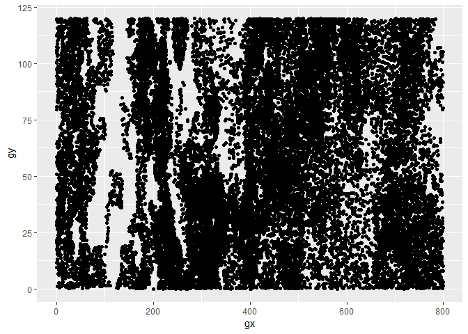

Can tt\_test() handle empty quadrats?
================

``` r
library(tidyverse)
```

    ## -- Attaching packages --------------------------------------------- tidyverse 1.2.1 --

    ## v ggplot2 3.0.0     v purrr   0.2.5
    ## v tibble  1.4.2     v dplyr   0.7.6
    ## v tidyr   0.8.1     v stringr 1.3.1
    ## v readr   1.1.1     v forcats 0.3.0

    ## -- Conflicts ------------------------------------------------ tidyverse_conflicts() --
    ## x dplyr::filter() masks stats::filter()
    ## x dplyr::lag()    masks stats::lag()

``` r
library(fgeo)
```

    ## -- Attaching packages --------------------------------------------- fgeo 0.0.0.9000 --

    ## v fgeo.abundance  0.0.0.9004     v fgeo.demography 0.0.0.9000
    ## v fgeo.base       0.0.0.9001     v fgeo.habitat    0.0.0.9006
    ## v fgeo.data       0.0.0.9002     v fgeo.map        0.0.0.9204
    ## v fgeo.abundance  0.0.0.9004     v fgeo.tool       0.0.0.9003

    ## 

Jennifer Baltzer reported that `tt_test()` fails if the census data
contains quadrats with no species. Here I run `tt_test()` with the
census data that Jennifer sent me, and with a synthetic habitat dataset.
I get no error, suggesting that the problem was not in the census data
but in the habitat data. I’ll need the habitat data to explore what the
problem might be.

``` r
path <- here::here("inst/issues/43/private/scotty.tree1.rdata")
load(path)
scotty <- scotty.tree1
as_tibble(scotty)
```

    ## # A tibble: 38,054 x 16
    ##    treeID tag   sp    quadrat    gx    gy stemID   dbh   hom ExactDate
    ##     <dbl> <chr> <chr> <chr>   <dbl> <dbl>  <int> <dbl> <dbl> <chr>    
    ##  1  31572 01-0~ pima  A1       0.85 17.4   36933    63   1.3 2013-05-~
    ##  2  31573 01-0~ pima  A1       1.26 19.2   36935    75   1.3 2012-06-~
    ##  3  31574 01-0~ pima  A1      17.4  13.9   36936    96   1.3 2012-06-~
    ##  4  31575 01-0~ pima  A1      15.0  18.6   36937   102   1.3 2012-06-~
    ##  5  31576 01-0~ pima  B1      20.8  13.6   36938    74   1.3 2012-06-~
    ##  6  31577 01-0~ pima  B1      33.3   2.33  36939    89   1.3 2012-06-~
    ##  7  31578 01-0~ pima  B1      30.1  16.6   36940    80   1.3 2012-06-~
    ##  8  31579 01-0~ pima  B1      38.4   0.64  36941    76   1.3 2012-06-~
    ##  9  31580 01-0~ pima  B1      39.2   4.81  36942    95   1.3 2012-06-~
    ## 10  31581 01-0~ pima  B1      37.7   9.66  36943    72   1.3 2012-06-~
    ## # ... with 38,044 more rows, and 6 more variables: codes <lgl>,
    ## #   date <int>, status <chr>, nostems <int>, agb <dbl>, ba <dbl>

Show gaps in the census dataset.

``` r
ggplot(scotty, aes(gx, gy)) + 
  geom_point()
```

<!-- -->

Create habitat data.

``` r
# Create elevation data
xy <- expand.grid(x = seq(0, 125, by = 20), y = seq(0, 800, by = 20))
elev <- sample.int(500, nrow(xy), replace = TRUE)
elevation <- bind_cols(tibble::as.tibble(xy), elev = elev)

# Create habitat data from elevation data
hab <- fgeo_habitat(elevation, xdim = 800, ydim = 125, gridsize = 20, n = 4)
hab
```

    ## # A tibble: 49 x 3
    ##       gx    gy habitats
    ##  * <int> <int>    <int>
    ##  1     0     0        3
    ##  2     0    20        3
    ##  3     0    40        4
    ##  4     0    60        1
    ##  5     0    80        1
    ##  6     0   100        1
    ##  7     0   120        3
    ##  8    20     0        2
    ##  9    20    20        1
    ## 10    20    40        3
    ## # ... with 39 more rows

Run `tt_test()` with all species.

``` r
all_species <- unique(scotty$sp)
tt_list <- tt_test(scotty,all_species, habitat = hab)
tt_list[1:3]
```

    ## [[1]]
    ##      N.Hab.1 Gr.Hab.1 Ls.Hab.1 Eq.Hab.1 Rep.Agg.Neut.1 Obs.Quantile.1
    ## pima     545        5      190        1              0      0.0255102
    ##      N.Hab.2 Gr.Hab.2 Ls.Hab.2 Eq.Hab.2 Rep.Agg.Neut.2 Obs.Quantile.2
    ## pima    1206      135       60        1              0      0.6887755
    ##      N.Hab.3 Gr.Hab.3 Ls.Hab.3 Eq.Hab.3 Rep.Agg.Neut.3 Obs.Quantile.3
    ## pima     849      103       92        1              0      0.5255102
    ##      N.Hab.4 Gr.Hab.4 Ls.Hab.4 Eq.Hab.4 Rep.Agg.Neut.4 Obs.Quantile.4
    ## pima     890      182       13        1              0      0.9285714
    ## 
    ## [[2]]
    ##      N.Hab.1 Gr.Hab.1 Ls.Hab.1 Eq.Hab.1 Rep.Agg.Neut.1 Obs.Quantile.1
    ## lala       0        0      156       40             -1              0
    ##      N.Hab.2 Gr.Hab.2 Ls.Hab.2 Eq.Hab.2 Rep.Agg.Neut.2 Obs.Quantile.2
    ## lala       2       99       96        1              0       0.505102
    ##      N.Hab.3 Gr.Hab.3 Ls.Hab.3 Eq.Hab.3 Rep.Agg.Neut.3 Obs.Quantile.3
    ## lala       3      189        6        1              0      0.9642857
    ##      N.Hab.4 Gr.Hab.4 Ls.Hab.4 Eq.Hab.4 Rep.Agg.Neut.4 Obs.Quantile.4
    ## lala       1       65      130        1              0      0.3316327
    ## 
    ## [[3]]
    ##      N.Hab.1 Gr.Hab.1 Ls.Hab.1 Eq.Hab.1 Rep.Agg.Neut.1 Obs.Quantile.1
    ## piba       0        0        0      196             -1              0
    ##      N.Hab.2 Gr.Hab.2 Ls.Hab.2 Eq.Hab.2 Rep.Agg.Neut.2 Obs.Quantile.2
    ## piba       0        0        0      196             -1              0
    ##      N.Hab.3 Gr.Hab.3 Ls.Hab.3 Eq.Hab.3 Rep.Agg.Neut.3 Obs.Quantile.3
    ## piba       0        0        0      196             -1              0
    ##      N.Hab.4 Gr.Hab.4 Ls.Hab.4 Eq.Hab.4 Rep.Agg.Neut.4 Obs.Quantile.4
    ## piba       0        0        0      196             -1              0

I get no error.
