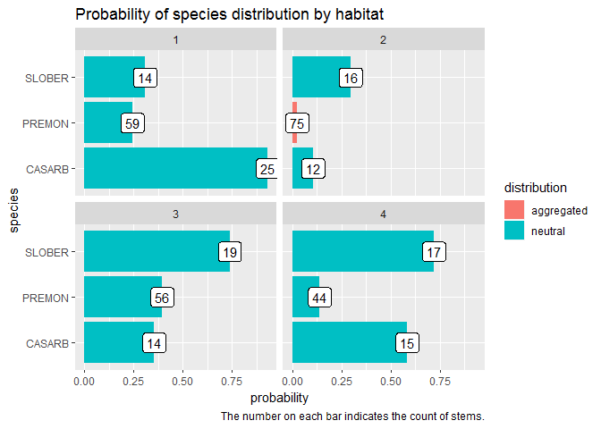

Restructure tt\_test() output
================

This document explores a new structure for the output of `tt_test()` for
easier manipulation and visualization.

Setup.

``` r
library(tidyverse)
## -- Attaching packages ------------------------------------------- tidyverse 1.2.1 --
## v ggplot2 3.0.0     v purrr   0.2.5
## v tibble  1.4.2     v dplyr   0.7.6
## v tidyr   0.8.1     v stringr 1.3.1
## v readr   1.1.1     v forcats 0.3.0
## -- Conflicts ---------------------------------------------- tidyverse_conflicts() --
## x dplyr::filter() masks stats::filter()
## x dplyr::lag()    masks stats::lag()
library(fgeo)
## -- Attaching packages ------------------------------------------- fgeo 0.0.0.9000 --
## v fgeo.abundance  0.0.0.9004     v fgeo.demography 0.0.0.9000
## v fgeo.base       0.0.0.9001     v fgeo.habitat    0.0.0.9006
## v fgeo.data       0.0.0.9002     v fgeo.map        0.0.0.9204
## v fgeo.abundance  0.0.0.9004     v fgeo.tool       0.0.0.9003
## 
```

Original output.

``` r
habitat <- luquillo_habitat
census <- luquillo_top3_sp

# Pick alive trees, of 10 mm or more
pick <- filter(census, status == "A", dbh >= 10)
# Pick sufficiently abundant trees
pick <- add_count(pick, sp)
pick <- filter(pick, n > 50)

# Test any number of sp
sp <- unique(pick$sp)
tt_lst <- tt_test(census, sp, habitat)
tt_df <- to_df(tt_lst)
```

The restructured output is easier to manipulate.

``` r
filter(tt_df, distribution == "aggregated")
## # A tibble: 1 x 9
##   habitat sp    probability distribution stem_count Eq.Hab Gr.Hab Ls.Hab
##   <chr>   <chr>       <dbl> <chr>             <dbl>  <dbl>  <dbl>  <dbl>
## 1 2       PREM~      0.0238 aggregated           75      1   1562     37
## # ... with 1 more variable: Obs.Quantile <dbl>

filter(tt_df, distribution == "neutral")
## # A tibble: 11 x 9
##    habitat sp    probability distribution stem_count Eq.Hab Gr.Hab Ls.Hab
##    <chr>   <chr>       <dbl> <chr>             <dbl>  <dbl>  <dbl>  <dbl>
##  1 1       CASA~       0.931 neutral              25      2   1489    109
##  2 1       PREM~       0.243 neutral              59      3    389   1208
##  3 1       SLOB~       0.308 neutral              14     16    492   1092
##  4 2       CASA~       0.105 neutral              12      1    168   1431
##  5 2       SLOB~       0.296 neutral              16      2    473   1125
##  6 3       CASA~       0.354 neutral              14      4    567   1029
##  7 3       PREM~       0.395 neutral              56      5    632    963
##  8 3       SLOB~       0.738 neutral              19      4   1181    415
##  9 4       CASA~       0.584 neutral              15      5    934    661
## 10 4       PREM~       0.139 neutral              44      3    222   1375
## 11 4       SLOB~       0.719 neutral              17      9   1151    440
## # ... with 1 more variable: Obs.Quantile <dbl>
```

The restructured output is easier to visualize.

``` r
ggplot(tt_df, aes(sp, probability)) + 
  geom_col(aes(fill = distribution), position = "dodge") +
  geom_label(aes(label = stem_count)) +
  facet_wrap(vars(habitat)) +
  labs(
    title = "Probability of species distribution by habitat",
    x = "species", 
    caption = "The number on each bar indicates the count of stems."
  ) +
  coord_flip()
```

<!-- -->
